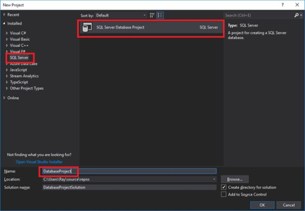

# Criação e versionamento de Databases SQL Server no VS 2017

Database Change Tracking With Visual Studio and Git

Normalmente, quando se trata de banco de dados SQL Server e desenvolvimento .NET, é comum se utilizar de algum ORM, tal como Entity Framework para mapear as entidades em alguma camada, ou até mesmo utilizar o Migrations em uma estratégia de Code First. Nesse cenário, qualquer alteração efetuada no banco de dados, digamos que por um DBA ou alguém da equipe, não será refletido automaticamente no seu código fonte, levando a erros.

Uma alternativa muito interessante e recomendada em alguns projetos, seria criar um projeto de banco de dados dentro da própria solução do projeto e gerenciar os objetos e suas alterações pela IDE, fazendo uso da feature Schema Compare.

## Benefícios e cenários para utilizar essa abordagem

- É possível criar ou atualizar os objetos do banco (tabelas, views, schemas, etc) diretamente do projeto
- É possível versionar o seu banco de dados como parte integral da sua solução
- É possível identificar rapidamente as alterações efetuadas no banco de dados, sabendo quem o fez e quando o fez
- É rápido para subir uma cópia da estrutura da sua base de dados em qualquer outro local

## O que é necessário para criar um Database Project no Visual Studio 2017

Além do Visual Studio 2017 instalado (podendo ser até a versão Community), será necessário instalar o SQL Server Data Tools para Visual Studio. Na referência do artigo, você pode encontrar o link. Efetue a instalação e depois reinicie sua máquina.


## Criando o projeto

Após instalação do SQL Server Data Tools para criar o projeto, abra o Visual Studio, selecione ```File > New > Projec```.

Existe uma categoria de instalação chamada “SQL Server” e uma opção de ```SQL Server Database Project```.



